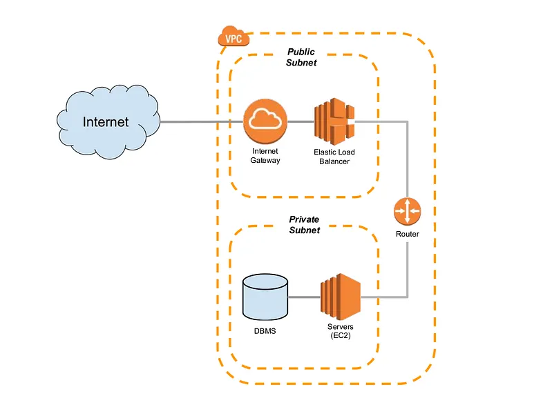

# 🚀 Jenkins-Terraform-AWS-Infra  

                                           

## 📖 **Comprehensive Guide & Tutorial**  

For a step-by-step explanation of this project, visit:  
🔗 [**Read the Full Article Here**](https://blog.prodevopsguy.xyz/aws-with-terraform-and-jenkins-pipeline)  

---                                                                                    
                                                                                                                      
## 📌 **Project Overview**  

This repository contains **Terraform** scripts to automate the provisioning of AWS infrastructure, including **VPC, Subnets, Security Groups, EC2 instances**, and Jenkins integration for **Infrastructure as Code (IaC)** deployment.  



### ✅ **Key Features**  

- Automates AWS **VPC, Subnets, Security Groups, and EC2 instances**.  
- Implements **public and private subnets** for better security.  
- Uses **Internet Gateway & NAT Gateway** for controlled internet access.  
- Configurable using **Terraform variables** for flexibility.  
- Outputs important details such as **instance IPs, subnet IDs, and VPC information**.  
- Includes **Jenkinsfile** for CI/CD pipeline automation.  

---

## 📂 **Project Structure**  

This project is structured as follows:  

```
JENKINS-TERRAFORM-AWS-INFRA/
│── .gitignore                  # Ignore unnecessary files in Git
│── ec2.tf                      # EC2 instance creation
│── ig_natgw.tf                 # Internet & NAT Gateway configuration
│── image.png                   # Architecture diagram/image
│── Jenkinsfile                  # Jenkins pipeline for automation
│── output.tf                    # Terraform output variables
│── providers.tf                 # AWS provider setup
│── README.md                    # Documentation
│── route-tables.tf              # Route table configurations
│── security-groups.tf           # Security group configurations
│── subnets.tf                   # Public & private subnets setup
│── terraform-dev.tfvars         # User-defined variables (dev environment)
│── variables.tf                 # Terraform input variables
│── vpc.tf                       # VPC creation
```

---

## ⚡ **Terraform Infrastructure Components**  

### **1. AWS Provider Configuration**  

- Defined in **providers.tf**.  
- Requires AWS **Access & Secret Key** (set via environment variables or Terraform variables).  

### **2. VPC (Virtual Private Cloud)**  

- Defined in **vpc.tf**.  
- Creates a **custom VPC** with a configurable CIDR block.  

### **3. Public & Private Subnets**  

- Managed in **subnets.tf**.  
- **Public Subnet:** For externally accessible resources (e.g., web servers).  
- **Private Subnet:** For internal services (e.g., databases, backend apps).  

### **4. Internet Gateway & NAT Gateway**  

- Configured in **ig_natgw.tf**.  
- Internet Gateway for public subnet instances.  
- NAT Gateway to allow private subnet instances to reach the internet securely.  

### **5. Route Tables**  

- Defined in **route-tables.tf**.  
- Routes for **public & private** subnet connectivity.  

### **6. Security Groups**  

- Managed in **security-groups.tf**.  
- Custom Ingress & Egress rules for EC2 instances.  
- Configurable ports (e.g., SSH, HTTP, HTTPS).  

### **7. EC2 Instances**  

- Configured in **ec2.tf**.  
- Deploys instances based on **instance type, AMI, and key pair**.  
- Associated with **security groups** and **subnets**.  

### **8. Terraform Variables & Outputs**  

- **variables.tf**: Defines configurable Terraform inputs.  
- **terraform-dev.tfvars**: Stores environment-specific variable values.  
- **output.tf**: Displays key infrastructure details (e.g., instance IPs, subnet IDs).  

---

## 🔧 **Prerequisites**  

Before using this Terraform setup, ensure you have:  

✔ **AWS Account** with necessary permissions.  
✔ **AWS CLI** installed and configured (`aws configure`).  
✔ **Terraform CLI** installed ([Download Here](https://developer.hashicorp.com/terraform/downloads)).  
✔ **Jenkins** installed (optional, for CI/CD automation).  
✔ **Basic knowledge of AWS, Terraform, and Infrastructure as Code (IaC)**.  

---

## 🔨 **Installation & Usage**  

### **1. Clone the Repository**  

Run the following command to clone the repository:  
```bash
git clone https://github.com/NotHarshhaa/Jenkins-Terraform-AWS-Infra.git
cd Jenkins-Terraform-AWS-Infra
```  

### **2. Initialize Terraform**  

```bash
terraform init
```  

### **3. Plan the Deployment**  

```bash
terraform plan
```  

### **4. Apply the Terraform Configuration**  

```bash
terraform apply -auto-approve
```  

### **5. Destroy the Infrastructure (if needed)**  

```bash
terraform destroy -auto-approve
```  

---

## 🚀 **CI/CD Integration with Jenkins**  

This project includes a **Jenkinsfile**, which defines an automated pipeline for infrastructure provisioning.  

### **Jenkins Pipeline Steps**  

1. Clone the repository  
2. Run Terraform initialization (`terraform init`)  
3. Execute Terraform plan (`terraform plan`)  
4. Apply Terraform configuration (`terraform apply -auto-approve`)  
5. Store Terraform outputs (e.g., instance details)  

📌 You can integrate this **Jenkinsfile** into your **Jenkins pipeline** to automate AWS infrastructure deployment.  

---

## 🤝 **Contributing**  

Contributions are welcome! If you find any issues or want to improve the project:  

1. Fork the repo  
2. Create a feature branch (`git checkout -b feature-name`)  
3. Commit changes (`git commit -m "Your message"`)  
4. Push to GitHub (`git push origin feature-name`)  
5. Open a **Pull Request** 🚀  

---

## 🛠️ **Author & Community**  

This project is crafted by **[Harshhaa](https://github.com/NotHarshhaa)** 💡.  
I’d love to hear your feedback! Feel free to share your thoughts.  

📧 **Connect with me:**

- **GitHub**: [@NotHarshhaa](https://github.com/NotHarshhaa)  
- **Blog**: [ProDevOpsGuy](https://blog.prodevopsguy.xyz)  
- **Telegram Community**: [Join Here](https://t.me/prodevopsguy)  
- **LinkedIn**: [Harshhaa Vardhan Reddy](https://www.linkedin.com/in/harshhaa-vardhan-reddy/)  

---

### 📢 **Stay Connected**  


